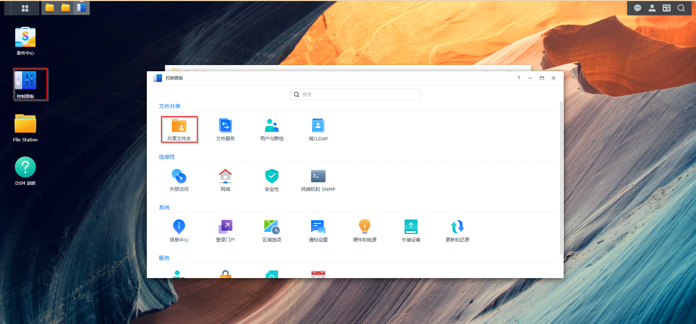
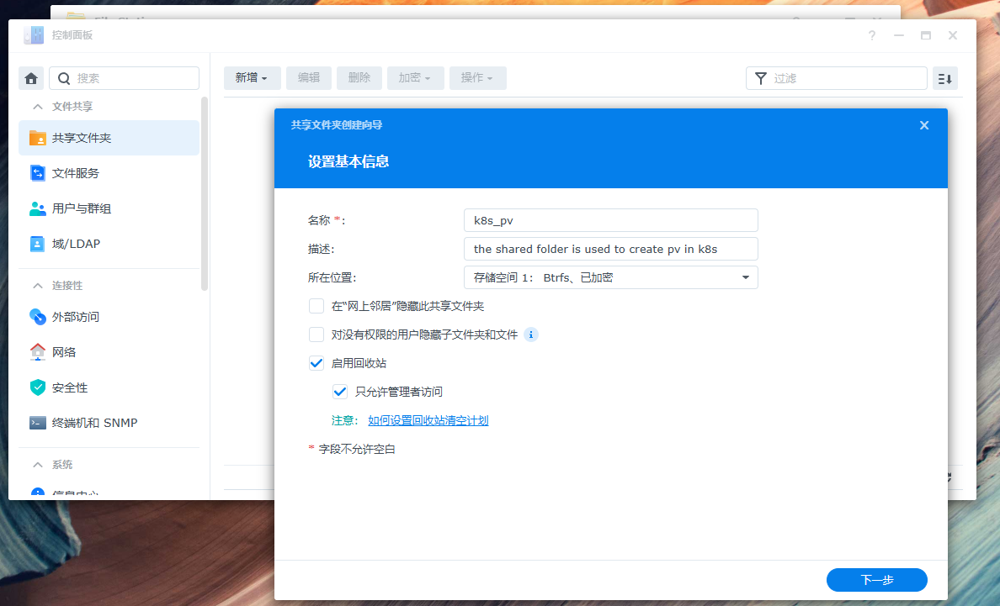
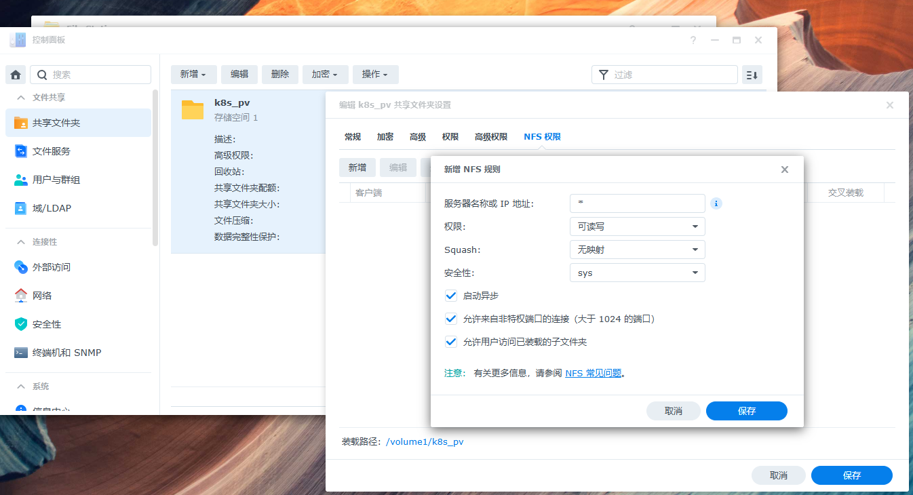

# CSI Driver for Kubernetes

在我们搭建完我们的本地k8s 集群后，我们还需要安装“Synology CSI Driver”，以便我们可以使用Synology Csi 作为我们 持久化磁盘（PV）

## 设置共享文件夹

* 登录你的Synology 的web 页面，打开左侧的控制面板，然后点击共享文件夹
* 创建一个新的共享文件夹
* 创建完成后，点击编辑设置其NFS权限

## 安装 NFS CSI Driver

### 安装Helm

```
tar -zxvf helm-v3.18.3-linux-amd64.tar.gz
cp linux-amd64/helm .local/bin/

```

### 安装 NFS CSI Driver 并且配置 storage Class

请查看该文档 https://github.com/lkburning/devops-career/blob/main/nfs-csi/Readme.md
