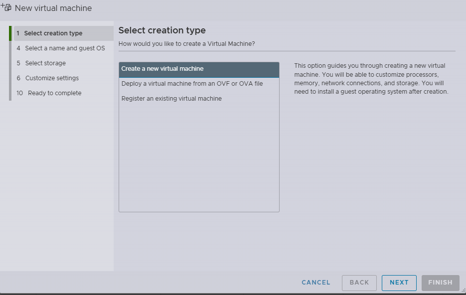

# 初始化Node 并加入 Master

本文将以ubuntu 为例，来说明如何配置一个k8s 的node 环境，并且使用 kubeadm 将其加入到master 节点中。

## 基于Ubuntu24.04 创建一个虚拟机

1. 打开你的本地浏览器登陆你的EXSI 的管理界面，如下所示
   
2. 创建一个虚拟机
   
3. 指定你的虚拟机的名字以及系统的兼容性

   
4. 配置你的虚拟机的需求（如，cpu，内存以及磁盘大小），并且指定从你的数据盘选中一个iso

   
5. 等待虚拟机创建好，启动的虚拟机并按照知道配置你的操作系统。
6. 操作系统配置好以后，你就从EXSI 的管理界面上得到你的这台虚拟机的ip 地址，如下所示。这台机器的ip 是192.168.1.10
   

## 安装容器运行时

由于k8s 已经使用 containerd 作为默认的运行时，接下来我们将会安装 containerd 作为运行时。

在Ubunut 环境有两种方式安装Containerd, 一种是通过“From the official binaries“，第二种便是 ”From `apt-get` or `dnf`”，出于方便考虑，我们使用apt-get 进行安装

### From apt-get install Containerd

office website: https://docs.docker.com/engine/install/ubuntu/

#### [Uninstall old versions](https://docs.docker.com/engine/install/ubuntu/#uninstall-old-versions)

```
for pkg in docker.io docker-doc docker-compose docker-compose-v2 podman-docker containerd runc; do sudo apt-get remove $pkg; done
```

#### [Install using the `apt` repository](https://docs.docker.com/engine/install/ubuntu/#install-using-the-repository)

1. Set up Docker's `apt` repository.

   ```
   # Add Docker's official GPG key:
   sudo apt-get update
   sudo apt-get install ca-certificates curl
   sudo install -m 0755 -d /etc/apt/keyrings
   sudo curl -fsSL https://download.docker.com/linux/ubuntu/gpg -o /etc/apt/keyrings/docker.asc
   sudo chmod a+r /etc/apt/keyrings/docker.asc

   # Add the repository to Apt sources:
   echo \
     "deb [arch=$(dpkg --print-architecture) signed-by=/etc/apt/keyrings/docker.asc] https://download.docker.com/linux/ubuntu \
     $(. /etc/os-release && echo "${UBUNTU_CODENAME:-$VERSION_CODENAME}") stable" | \
     sudo tee /etc/apt/sources.list.d/docker.list > /dev/null
   sudo apt-get update
   ```
2. Install the Docker packages.

   ```
   sudo apt-get install docker-ce docker-ce-cli containerd.io docker-buildx-plugin docker-compose-plugin
   ```
3. [Manage Docker as a non-root user](https://docs.docker.com/engine/install/linux-postinstall/#manage-docker-as-a-non-root-user)

   ```
   sudo groupadd docker
   sudo usermod -aG docker $USER
   newgrp docker
   ```

### 配置Containerd 以及Docker Daemon 使用Proxy

由于国内环境不能访问大部分的k8s 的官方镜像，因此我们需要配置 containerd 以及 docker daemon 去使用proxy。通过如上方式安装的containerd 以及 docker daemon 都会自动的创建 systemd 的service, 因此我们只需要更新service unit 即可

1. 配置containerd 的 proxy

   ```
   sudo vim /lib/systemd/system/containerd.service
   cat /lib/systemd/system/containerd.service
   ---------------------------------------------------
   [Service]
   #uncomment to enable the experimental sbservice (sandboxed) version of containerd/cri integration
   #Environment="ENABLE_CRI_SANDBOXES=sandboxed"
   Environment="HTTP_PROXY=http://192.168.1.125:7890/"
   Environment="HTTPS_PROXY=http://192.168.1.125:7890/"
   Environment="NO_PROXY=localhost,127.0.0.1,192.168.1.0/24,10.0.0.0/8"
   ExecStartPre=-/sbin/modprobe overlay
   ExecStart=/usr/bin/containerd
   ------------------------------------------------------

   ```
2. 配置docker daemon 的proxy

   ```
   sudo vim /lib/systemd/system/docker.service
   cat  /lib/systemd/system/docker.service
   -------------------------------------------
   [Service]
   Type=notify
   # the default is not to use systemd for cgroups because the delegate issues still
   # exists and systemd currently does not support the cgroup feature set required
   # for containers run by docker
   Environment="HTTP_PROXY=http://192.168.1.125:7890/"
   Environment="HTTPS_PROXY=http://192.168.1.125:7890/"
   Environment="NO_PROXY=localhost,127.0.0.1,192.168.1.0/24,10.0.0.0/8"
   ExecStart=/usr/bin/dockerd -H fd:// --containerd=/run/containerd/containerd.sock
   ExecReload=/bin/kill -s HUP $MAINPID
   TimeoutStartSec=0
   RestartSec=2
   Restart=always
   -------------------------------------------
   ```
3. 重新reload 更新的service unit, 然后重启docker 以及containerd 以应用如上的修改

   ```
   sudo systemctl daemon-reload
   sudo systemctl restart docker
   sudo systemctl restart containerd
   ```

### 安装kubelet 并且安装 kubeadm ，并且禁止swap

1. 禁止swap 在 ubuntu

   ```
   sudo nano /etc/fstab
   # comment the line /swap.img       none    swap    sw      0       0
   sudo reboot

   ```
2. 安装kubectl 以及kubeadm

   ```
   sudo apt-get install -y apt-transport-https ca-certificates curl gpg
   curl -fsSL https://pkgs.k8s.io/core:/stable:/v1.33/deb/Release.key | sudo gpg --dearmor -o /etc/apt/keyrings/kubernetes-apt-keyring.gpg
   echo 'deb [signed-by=/etc/apt/keyrings/kubernetes-apt-keyring.gpg] https://pkgs.k8s.io/core:/stable:/v1.33/deb/ /' | sudo tee /etc/apt/sources.list.d/kubernetes.list
   sudo apt-get update
   sudo apt-get install -y kubelet kubeadm kubectl
   sudo apt-mark hold kubelet kubeadm kubectl


   ```

### 加入此Node 到 master 节点

1. 生成join 命令在master 节点

   ```
   kubeadm token create --print-join-command
   ```
2. 在node 节点使用sudo 执行命令，便可以成功加入节点

   ```
   sudo kubeadm join 192.168.1.11:6443 --token 08xg9j.j2mx8hwfh70qz5tj --discovery-token-ca-
   cert-hash sha256:a67b7bab9b024fb69c6aadb82b9f11e671ef5ec7881b06f23a54c9abf72bcbd0
   ```
3. 通过kubectl命令查看新加入的Node

   ```
   kubectl get nodes
   NAME              STATUS   ROLES           AGE     VERSION
   k8s-master        Ready    control-plane   15d     v1.32.5
   operation-node1   Ready    <none>          2m13s   v1.33.1
   ```
